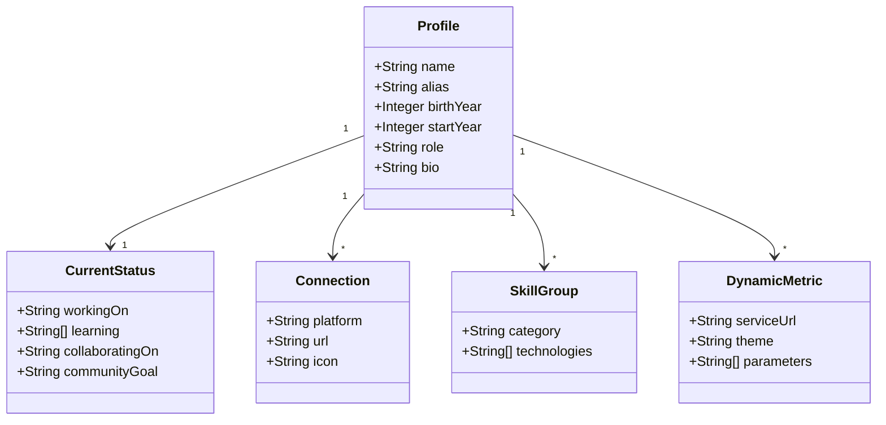

# Data Model: GitHub Profile README

Embora o README seja um documento Markdown estático/apresentacional, ele estrutura e reflete as seguintes entidades lógicas de dados do perfil de Franclin:

## Entidades e Atributos

### 1. Profile
- **name**: Franclin
- **alias**: Frank / Ragnar
- **birthYear**: 1995
- **startYear**: 2012
- **role**: Engenheiro de Software
- **bio**: Apaixonado por linguagens de programação, astronomia, tecnologia e música.

### 2. CurrentStatus
- **workingOn**: Camunda Platform
- **learning**: AWS, Event Driven Architecture, Golang, Kotlin
- **collaboratingOn**: WIP
- **communityGoal**: Colaboração em comunidades Tech no Discord

### 3. Connections (Espelhadas do Gravatar)
- **LinkedIn**: `https://www.linkedin.com/in/fssou`
- **X/Twitter**: `https://x.com/frnclnslvss`
- **Reddit**: `https://www.reddit.com/user/fssou`
- **GitHub**: `https://github.com/fssou`
- **Telegram**: `https://t.me/fssou`
- **Twitch**: `https://twitch.tv/fssou`
- **StackOverflow**: `https://stackoverflow.com/users/8739828/franclin`
- **GitLab**: `https://gitlab.com/fssou`
- **YouTube**: `https://www.youtube.com/channel/UCCMAliAVvB9M8rT6aGgVTbQ`
- **PayPal**: `https://www.paypal.com/donate/?hosted_button_id=DCVU8F9M2WB6E`
- **E-mail**: `f@francl.in`

### 4. SkillGroups
- **Linguagens**: Java, TypeScript, Kotlin, Scala, Go, JavaScript, Bash, Python
- **Frameworks**: Ktor, Spring, Node.js, Express, Flask, Vue.js, Nuxt, Bootstrap, TailwindCSS
- **DevOps/Cloud**: Kubernetes, Docker, AWS, Kafka, Linux
- **Bancos e Dados**: MongoDB, MySQL, Oracle, PostgreSQL, Redis, SQLite, Kibana, Elasticsearch, Grafana
